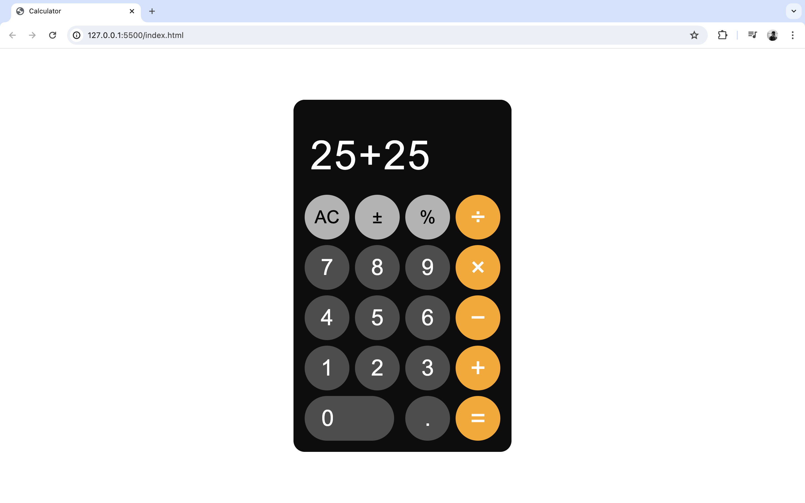

# iPhone-Style Calculator

A simple, functional iPhone-style calculator built using HTML, CSS, and JavaScript.

## Features

- Basic arithmetic operations: addition, subtraction, multiplication, and division
- Clear (C) and backspace functionality
- Responsive design inspired by the iPhone calculator interface

## Usage

- Click on the calculator buttons to perform calculations.
- The display will show the current input and results of operations.

## Files

- `index.html`: The main HTML file containing the structure of the calculator.
- `styles.css`: The CSS file for styling the calculator.
- `script.js`: The JavaScript file for calculator functionality.

## License

This project is licensed under the MIT License.
